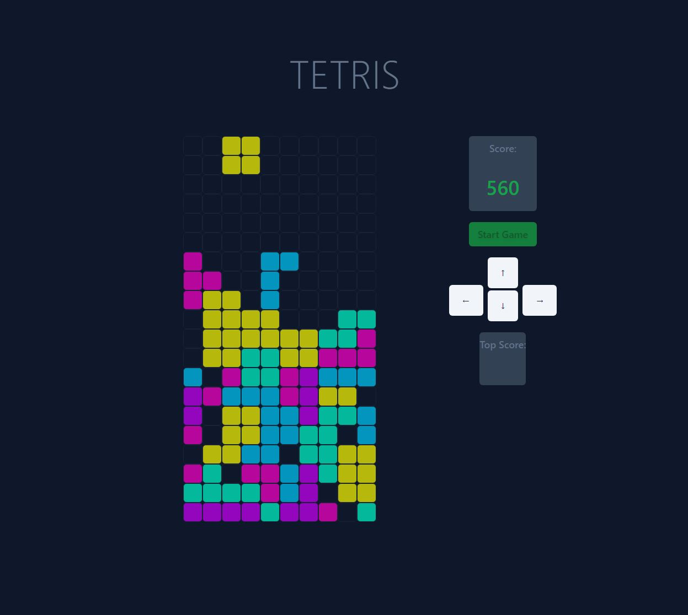

# Tetris

A game of tetris made with Javascript. The site is styled for screens that are more than 620px wide.

## Project setup

```
npm install
```

### Compiles and hot-reloads for development

```
npm run serve
```

### Compiles and minifies for production

```
npm run build
```

### Run your unit tests

```
npm run test:unit
```

### Lints and fixes files

```
npm run lint
```

### Screenshot:



## Build with:

- [VUE.js](https://cli.vuejs.org/) - Javascript framework - used because I really like working with it and enjoy the workflow
- [Tailwindcss](https://tailwindcss.com/) - CSS framework - used because I like working with it and it enables me to style components quickly, meaning I can use my time for other things that I find more important (like testing).

### Picture sources:

- [github and linkedin icons](https://www.flaticon.com/authors/roundicons-premium)
- [hamburger icon](https://www.flaticon.com/authors/freepik)
